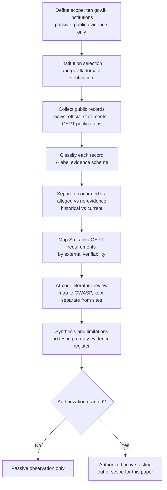

# Figure 4. Research methodology (flowchart source)

Render this Mermaid source to an image for the manuscript (see
`../ieee-formatting-notes.md`).

```mermaid
flowchart TD
    A[Define scope: ten gov.lk institutions<br/>passive, public evidence only] --> B[Institution selection<br/>and gov.lk domain verification]
    B --> C[Collect public records<br/>news, official statements, CERT publications]
    C --> D[Classify each record<br/>7-label evidence scheme]
    D --> E[Separate confirmed vs alleged vs no-evidence<br/>historical vs current]
    E --> F[Map Sri Lanka CERT requirements<br/>by external verifiability]
    F --> G[AI-code literature review<br/>map to OWASP, kept separate from sites]
    G --> H[Synthesis and limitations<br/>no testing, empty evidence register]
    H --> I{Authorization granted?}
    I -- No --> J[Passive observation only]
    I -- Yes --> K[Authorized active testing<br/>out of scope for this paper]
```
